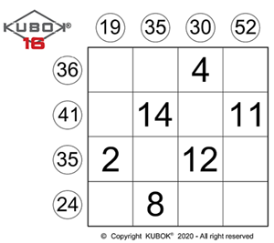

# Kubok 16 - Evaluative Assignment

For this assignment, you will need to write a solver for a Kubok 16 puzzle,
a numbers-based logic game.

The board is composed of a 4 by 4 grid. Numbers from 1 to 16 must be placed
into the grid to solve the puzzle. No number may repeat.  Each column must 
add up to the numbers along the top of the grid.  Each row must add up to 
the numbers along the left side of the grid. Some cells already have a
number defined for that cell and cannot be changed.



This is an evaluative assignment - ensure you follow the rules listed in 
the academic integrity section.

## Program
Write a program "kubok" that takes a single command-line argument containing
the name of a file that contains the initial state of a puzzle.

## Input file
The input file contains the following contents:
- The first line has the prefix "column sums:" followed by four numbers,
  each between 10 and 58.
- The second line has the prefix "row sums:" followed by four numbers,
  each between 10 and 58.
- The third line contains the text "grid:".
- Lines 4-7 contain four numbers.  Use 0 to represent an empty cell.
  The numbers must be between 0 and 16.  Numbers from 1 to 16 cannot be
  repeated.

You will need to validate that the input file (and the starting puzzle)
is valid. If not, print an error message to standard error and exit the
program with `EXIT_FAILURE`.

Sample file
```
column sums: 19,35,30,52
row sums: 36,41,35,24
grid:
0,0,4,0
0,14,0,11
2,0,12,0
0,8,0,0
```

## Expected Output
Once the program has solved the puzzle, output the solution in the following
format:
```
    19 35 30 52
 36  9  7  4 16
 41  3 14 13 11
 35  2  6 12 15
 24  5  8  1 10
```

## Implementation Approach
You are free to implement this in any reasonable way.  As with the other 
evaluative assignments, you will be graded on code quality. Some items to 
consider:
- How is your application structured into different files?
- How are your methods and variables named?
- How is the puzzle represented?
- Do you have duplicative code?
- Is the code formatted appropriately?
- Comments used appropriately?

## Grader
As this assignment is the final evaluation for the course, we will not provide
direct results of the test cases. You will be expected to create your test 
cases. The assignment grader will run your test cases against your submission 
and the reference implementation. You need to create a "testcases.txt" file 
that has two sections:
- #error: lists any test cases that should generate an error message and 
  an exit code.
- #success: lists any test cases that should run normally.  The outputs from the 
  two implementations will be compared.

You may create additional files (e.g. a file with bad input data) as part of 
your submission.

Sample testcases.txt:
```
#error
missing_rows.txt

#success
sample_easy.txt
```

Your testcases.txt will not be graded.  The grading breakdown will be 95% for test cases generated by the instructors and 5% for a code review.

## Submission
Submit your Makefile, all associated code files, testcases.txt, and any associated data files to the Gradescope assignment. For the data files, you do need to include the provided data files if they are part of your test cases.


## Academic Integrity
**Note:** This is an evaluative assignment!  By submitting this assignment, you agree that you have adhered to the following rules:
- Your work must be your own!
- You may NOT consult with other students about:
  - high-level approaches,
  - how to implement your algorithm in code, or
  - how to debug your code.
  (Basically, you may not discuss anything particular to this assignment).
- You may NOT look at another student's code, nor show your code to anyone else.
- You are responsible for keeping your code private.
- You may not look for solutions to this or similar problems online.
- You may not use code from any other source besides what is listed here.
- You may not use any AI assistive technology (e.g., ChatGPT)
- You MAY consult Programming: Principles and Practices Using C++.
- You MAY consult any docable page provided for this class.
- You MAY consult cppreference.com, cplusplus.com
-	You MAY consult any C++ book on the O'Reilly Learning Platform
-	You MAY consult notes you wrote in your notebook.
-	You MAY consult the man pages.
-	You MAY ask the professor or TAs for assistance on the assignment.
 
If you use code from one of the approved sources, you should reference that source in a comment just prior to the function or code section. This includes any prior assignments.
